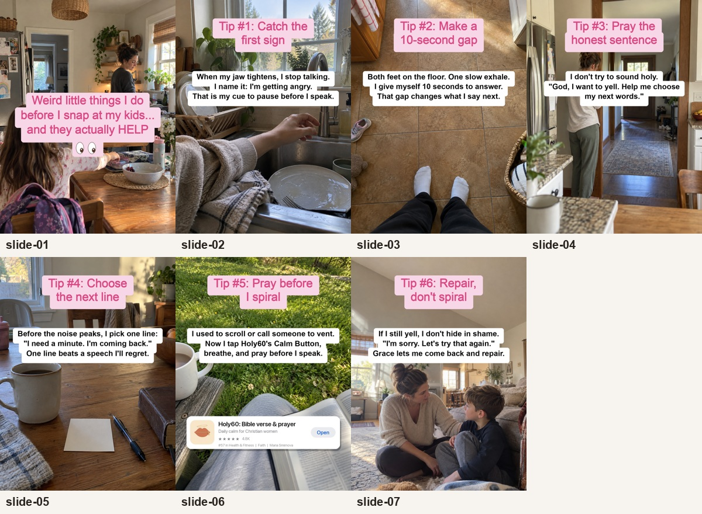

# Пример одного формата: карусель Holy60

Это готовая семислайдовая адаптация для приложения Holy60. Она показывает, как из смысловой и визуальной формулы одного поста собрать собственную историю с нативной интеграцией продукта. Это **пример работы [скилла по адаптации каруселей](../../skills/reference-carousel-adapter/SKILL.md)**, а не универсальный текстовый шаблон для всех продуктов.

**Оригинал-референс:** [карусель @studywith.evelyn в TikTok](https://www.tiktok.com/@studywith.evelyn/photo/7627272727711255830). Исходные кадры использовались для анализа формулы и в эту папку не копировались.

Открыть кадры в полном размере: [1](slides/slide-01.png) · [2](slides/slide-02.png) · [3](slides/slide-03.png) · [4](slides/slide-04.png) · [5](slides/slide-05.png) · [6](slides/slide-06.png) · [7](slides/slide-07.png).

Фоны были созданы отдельно, а текст и реальная карточка приложения наложены при сборке. Для исправления текста не нужно заново генерировать фото. Размер каждого кадра — 1200 × 1600 px. В этом конкретном референсе использовался Arial; для TikTok-native текста в других референсах смотрите [гайд по text overlay и установке TikTok Sans](../../skills/reference-carousel-adapter/references/text-overlay.md).
